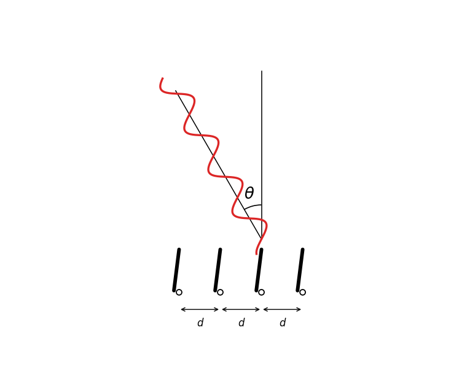

# Adaptive Beamforming: Theory, Simulation and Embedded Implementation

## Table of Contents

1. [Introduction](#1-introduction)
2. [What is Beamforming?](#2-what-is-beamforming)
3. [RF Waves, Phase and Wavelength](#3-rf-waves-phase-and-wavelength)
4. [Antenna Arrays](#4-antenna-arrays)
5. [Steering Vector](#5-steering-vector)
6. [Delay-and-Sum Beamforming](#6-delay-and-sum-beamforming)
7. Beam Pattern and Polar Visualization
8. Multi-Source RF Environment
9. Covariance Matrix
10. Adaptive Beamforming Methods
    - 10.1 MVDR
    - 10.2 LMS
    - 10.3 RLS
    - 10.4 Null Steering
11. DOA Estimation
    - 11.1 MUSIC
    - 11.2 ESPRIT
12. AI-Assisted RF Analysis
13. Step-by-Step Code Implementation
14. Realtime Beam Scan Simulation
15. Embedded Hardware Architecture
16. Antenna Array Design
17. Safety, Legal and Ethical Notes
18. Roadmap

---

# 1. Introduction

Modern wireless systems operate in increasingly dense and complex electromagnetic environments.

Wi-Fi, 5G, satellite communications, radar systems, drones, IoT devices and modern defense systems all rely on the ability to detect useful signals while rejecting noise, interference and unwanted transmissions.

A traditional antenna usually receives or radiates energy over a broad angular region. Beamforming introduces a different approach:

> Instead of relying on a single antenna element, multiple antennas are combined to create a controllable spatial response.

This makes it possible to:

- electronically steer reception or transmission,
- focus sensitivity toward a desired direction,
- attenuate unwanted directions,
- improve signal quality,
- and adapt dynamically to the RF environment.

This project builds an adaptive beamforming simulation framework from the ground up, starting from RF wave physics and progressing toward beam patterns, multi-source environments, adaptive algorithms and embedded implementation.

---

# 2. What is Beamforming?

Beamforming is a signal processing technique that uses several antenna elements to control how electromagnetic waves are received or transmitted in space.

The key idea is that a radio wave arriving from a given direction does not reach every antenna at exactly the same time. Since the antennas are physically separated, the wave travels slightly different distances before reaching each element.

These tiny delays create phase differences across the antenna array.

Beamforming exploits these phase differences by applying complex weights to each antenna signal. With the right weights, signals from a desired direction add constructively, while signals from other directions are attenuated.

---

## Intuitive Visualization

Consider a simple linear antenna array:

```text
A0 ---- A1 ---- A2 ---- A3
```

Now imagine a radio wave arriving from an angle:



Because the wavefront is tilted with respect to the array, it reaches some antennas before others.

For example:

- one antenna may receive the wave first,
- neighboring antennas receive it slightly later,
- and this delay creates a progressive phase shift across the array.

This phase progression is the spatial information used by beamforming algorithms.

---

## Beamforming as Spatial Filtering

Beamforming can be understood as a form of spatial filtering.

Traditional DSP asks:

```text
Which frequency should be amplified?
```

Beamforming asks:

```text
Which direction should be amplified?
```

Instead of filtering over time or frequency, beamforming filters over space.

This transforms an antenna array into an intelligent spatial sensor capable of selecting directions, rejecting interference and tracking moving sources.

---

## Constructive and Destructive Interference

Beamforming relies on wave interference.

If signals are aligned in phase, they add constructively:

```text
+ + + + +  → strong output
```

If signals are misaligned, they partially cancel:

```text
+ - + - +  → weak output
```

The role of the beamformer is to align signals from the desired direction so that they add coherently.

---

## Beam Steering

Beam steering is the process of electronically changing the direction of maximum sensitivity.

For example:

```text
Target direction = +30°
```

The beamformer applies phase corrections so that signals arriving from `+30°` are aligned before summation.

No mechanical rotation is required. The steering is performed entirely by signal processing.

---

## Beam Pattern

The spatial response of the array is called the beam pattern.

It describes:

- where the array has maximum gain,
- where signals are attenuated,
- how directional the system is,
- and where spatial nulls appear.

A typical beam pattern contains:

- a main lobe,
- side lobes,
- and nulls.

These concepts become essential when studying adaptive beamforming, MVDR and null steering.

---

## Main Types of Beamforming

### Delay-and-Sum Beamforming

Delay-and-Sum is the simplest beamforming method.

It aligns the phase of signals arriving from the desired direction and sums them together.

It is simple, intuitive and computationally lightweight, but it has limited interference rejection.

### Adaptive Beamforming

Adaptive beamforming adjusts its weights according to the signal environment.

It uses statistical information about the received signals to reduce interference and improve spatial selectivity.

Important adaptive methods include:

- MVDR,
- LMS,
- RLS,
- adaptive null steering.

### Null Steering

Null steering creates deep attenuation regions toward unwanted sources.

Example:

```text
Desired signal  → +20°
Interference    → -40°
```

The beamformer tries to maximize gain toward `+20°` while creating a null toward `-40°`.

### Digital Beamforming

In digital beamforming, each antenna has its own RF chain and is digitized independently.

This allows highly flexible processing, multiple simultaneous beams and advanced DSP algorithms.

Digital beamforming is widely used in:

- phased-array radar,
- 5G massive MIMO,
- SDR systems,
- satellite communication,
- modern wireless systems.

---

# 3. RF Waves, Phase and Wavelength

To understand beamforming, we first need to understand how radio waves propagate.

Beamforming relies on four key physical concepts:

- wave propagation,
- phase,
- wavelength,
- and interference.

---

## Electromagnetic Waves

Radio signals are electromagnetic waves. They propagate through space at approximately the speed of light:

$$
c \approx 3 \times 10^8 \ \text{m/s}
$$

An electromagnetic wave contains an electric field and a magnetic field oscillating together while traveling through space.

---

## Sinusoidal Signal Model

A simple RF signal can be modeled as:

$$
s(t) = A \cos(2\pi f t + \phi)
$$

where:

- `A` is the amplitude,
- `f` is the frequency,
- `t` is time,
- `φ` is the phase.

Amplitude describes signal strength. Frequency describes how fast the wave oscillates. Phase describes the position of the wave within its oscillation cycle.

---

## Phase

Two signals can have the same amplitude and frequency but different phases.

For example:

$$
s_1(t) = \cos(\omega t)
$$

$$
s_2(t) = \cos(\omega t + \frac{\pi}{2})
$$

The second signal is shifted by `90°`.

Phase is central in beamforming because the antenna array mainly extracts directional information from phase differences.

---

## Wavelength

The wavelength is the physical distance traveled by the wave during one complete oscillation.

It is denoted by `λ`.

The relationship between wavelength and frequency is:

$$
\lambda = \frac{c}{f}
$$

For a signal at `2.4 GHz`:

$$
\lambda = \frac{3 \times 10^8}{2.4 \times 10^9}
$$

$$
\lambda \approx 0.125 \ \text{m}
$$

So at `2.4 GHz`, the wavelength is approximately:

```text
12.5 cm
```

---

## Why Wavelength Matters

Wavelength determines:

- antenna dimensions,
- antenna spacing,
- phase progression,
- beamforming behavior,
- angular resolution.

In antenna arrays, a common spacing is:

$$
d = \frac{\lambda}{2}
$$

This spacing reduces spatial ambiguities and helps produce stable beam patterns.

---

## Path Difference

Consider two antennas separated by distance `d`:

```text
A0 ---- d ---- A1
```

If a wave arrives from an angle `θ`, the wave travels an additional distance before reaching the next antenna.

This extra distance is the path difference:

$$
\Delta d = d \sin(\theta)
$$

---

## Time Delay

Since the wave travels at speed `c`, this path difference creates a time delay:

$$
\Delta t = \frac{\Delta d}{c}
$$

Substituting the path difference:

$$
\Delta t = \frac{d \sin(\theta)}{c}
$$

This delay is extremely small, but at RF frequencies it creates a measurable phase shift.

---

## From Time Delay to Phase Shift

For a sinusoidal signal, a time delay corresponds to a phase rotation.

The phase shift is:

$$
\Delta \phi = 2\pi f \Delta t
$$

Using:

$$
\Delta t = \frac{d \sin(\theta)}{c}
$$

we obtain:

$$
\Delta \phi = 2\pi f \frac{d \sin(\theta)}{c}
$$

Since:

$$
\lambda = \frac{c}{f}
$$

the phase shift becomes:

$$
\Delta \phi = \frac{2\pi}{\lambda} d \sin(\theta)
$$

We define the wave number:

$$
k = \frac{2\pi}{\lambda}
$$

Therefore:

$$
\Delta \phi = k d \sin(\theta)
$$

This equation appears throughout beamforming theory.

---

## Complex Representation

In RF DSP, signals are often represented using complex exponentials:

$$
s(t) = A e^{j(2\pi f t + \phi)}
$$

The physical real-valued signal is the real part of this expression.

Complex notation makes phase manipulation much easier, which is why beamforming algorithms usually work with complex IQ signals and complex steering vectors.

---

## Narrowband Assumption

Most introductory beamforming models use the narrowband assumption.

This means the signal bandwidth is small compared to the carrier frequency.

Under this assumption, propagation delays can be modeled as phase shifts, which greatly simplifies the mathematics.

This is the assumption used in the first simulations of this project.

---

# 4. Antenna Arrays

A beamforming system uses multiple antenna elements distributed in space.

This set of antennas is called an antenna array.

The array geometry directly affects:

- beamwidth,
- angular resolution,
- side lobes,
- interference rejection,
- and direction-of-arrival estimation.

---

## Why Multiple Antennas?

A single antenna can measure signal amplitude, frequency and phase, but it cannot reliably determine where a signal comes from.

To estimate direction, we need several spatial observation points.

An antenna array provides exactly that.

Each antenna receives a slightly different version of the same wave, and these differences contain directional information.

---

## Uniform Linear Array

The simplest array geometry is the Uniform Linear Array, or ULA.

```text
A0 ---- A1 ---- A2 ---- A3
```

A ULA is defined by:

- `N`: number of antenna elements,
- `d`: spacing between adjacent elements,
- linear alignment.

The position of antenna `n` is:

$$
x_n = nd
$$

where:

```text
n = 0, 1, 2, ..., N-1
```

---

## Why λ/2 Spacing?

The most common spacing is:

$$
d = \frac{\lambda}{2}
$$

This choice provides a good balance between angular resolution and spatial ambiguity.

If antennas are spaced too far apart:

$$
d > \frac{\lambda}{2}
$$

the array can produce grating lobes.

Grating lobes are false spatial responses, similar to aliasing in time-domain DSP.

---

## Array Aperture

The physical length of the array is called the aperture.

For a linear array:

$$
D = (N - 1)d
$$

A larger aperture generally gives:

- narrower beams,
- better angular resolution,
- improved spatial selectivity.

---

## Main Lobe, Side Lobes and Nulls

The spatial response of an antenna array usually contains three important features.

### Main Lobe

The main lobe is the direction of maximum gain.

It represents the main direction in which the array is listening or transmitting.

### Side Lobes

Side lobes are secondary unwanted responses.

They can receive interference and reduce performance.

### Nulls

Nulls are directions where the array response is very small.

They are especially useful for rejecting interference.

---

## Common Array Geometries

### Linear Array

```text
A0 ---- A1 ---- A2 ---- A3
```

Simple, intuitive and widely used for introductory beamforming.

### Circular Array

```text
       A1
   A0      A2

   A5      A3
       A4
```

Useful for full `360°` directional coverage.

### Planar Array

```text
A0 ---- A1 ---- A2
 |       |       |
A3 ---- A4 ---- A5
```

Used for two-dimensional beam steering in azimuth and elevation.

---

## Antenna Arrays as Spatial Sensors

Traditional DSP samples signals over time:

$$
x(t)
$$

An antenna array samples the electromagnetic field over space:

$$
x(x_n)
$$

This is why beamforming is often called spatial signal processing.

The array converts wave propagation into measurable phase relationships that can be processed digitally.

---

# 5. Steering Vector

The steering vector describes how a wave arriving from a given direction appears across the antenna array.

It is the mathematical signature of a direction.

Almost every beamforming algorithm uses steering vectors, including:

- Delay-and-Sum,
- MVDR,
- MUSIC,
- ESPRIT,
- Null Steering.

---

## Physical Meaning

For a ULA, a wave arriving from angle `θ` creates a phase progression across antennas.

If the phase shift between adjacent antennas is `Δφ`, then the antenna phases may look like:

```text
A0 → 0
A1 → Δφ
A2 → 2Δφ
A3 → 3Δφ
```

The steering vector stores this progression in complex form.

---

## Derivation

For a ULA:

$$
\Delta d = d \sin(\theta)
$$

The corresponding phase shift is:

$$
\Delta \phi = k d \sin(\theta)
$$

where:

$$
k = \frac{2\pi}{\lambda}
$$

For antenna index `n`, the phase shift is:

$$
\phi_n = n k d \sin(\theta)
$$

Using complex exponentials, the response of antenna `n` is:

$$
a_n(\theta) = e^{j n k d \sin(\theta)}
$$

Therefore, the full steering vector is:

$$
\mathbf{a}(\theta) =
\begin{bmatrix}
1 \\
e^{jkd\sin(\theta)} \\
e^{j2kd\sin(\theta)} \\
\vdots \\
e^{j(N-1)kd\sin(\theta)}
\end{bmatrix}
$$

---

## Interpretation

Each element of the steering vector corresponds to one antenna.

The steering vector depends on:

- the angle of arrival `θ`,
- the antenna spacing `d`,
- the wavelength `λ`,
- the number of antennas `N`.

Different directions produce different steering vectors.

This is what allows the array to distinguish signals spatially.

---

## Example

For:

```text
N = 4
d = λ / 2
θ = 30°
```

we have:

$$
kd\sin(\theta) =
\frac{2\pi}{\lambda}
\cdot
\frac{\lambda}{2}
\cdot
\sin(30^\circ)
$$

Since:

$$
\sin(30^\circ) = \frac{1}{2}
$$

we get:

$$
kd\sin(\theta) = \frac{\pi}{2}
$$

The steering vector becomes approximately:

$$
\mathbf{a}(30^\circ) =
\begin{bmatrix}
1 \\
j \\
-1 \\
-j
\end{bmatrix}
$$

This represents a `90°` phase progression between adjacent antennas.

---

## Steering Vector in This Project

In this project, the steering vector is implemented by:

```python
compute_steering_vector(...)
```

The function computes:

- the wave number,
- the phase progression,
- the complex response of each antenna.

This steering vector is then used to compute beamforming weights, beam patterns and future adaptive algorithms.

---

# 6. Delay-and-Sum Beamforming

Delay-and-Sum is the simplest beamforming method.

Its goal is to align signals arriving from a desired direction and then sum them coherently.

If the phases are correctly aligned, the desired signal adds constructively.

---

## Core Idea

Assume a wave arrives from a target direction:

```text
θ_target = +30°
```

Because of propagation delays, each antenna receives a different phase.

The beamformer applies phase corrections so that the signals from `θ_target` become aligned.

After alignment, summing the signals produces a stronger output.

---

## Mathematical Model

Let:

- `x` be the received signal vector,
- `w` be the beamforming weight vector,
- `y` be the beamformer output.

The beamformer output is:

$$
y = \mathbf{w}^{H}\mathbf{x}
$$

where `H` denotes the conjugate transpose.

---

## Delay-and-Sum Weights

For Delay-and-Sum beamforming, the weights are built from the steering vector of the target direction:

$$
\mathbf{w} =
\frac{1}{N}
\mathbf{a}(\theta_{target})
$$

The factor `1/N` normalizes the output so that the gain does not grow artificially with the number of antennas.

Depending on the sign convention used for the steering vector, some formulations use the complex conjugate of the steering vector. The important point is consistency between the steering vector definition and the beamforming weight definition.

---

## Beam Pattern

The beam pattern describes how strongly the beamformer responds to each direction.

It is computed by testing the beamformer against steering vectors from different angles:

$$
B(\theta) =
\mathbf{w}^{H}
\mathbf{a}(\theta)
$$

The power gain is usually plotted as:

$$
G(\theta) = |B(\theta)|^2
$$

---

## Physical Meaning

If `θ` equals the target direction, the phases align and the gain is high.

If `θ` is far from the target direction, the phases do not align well and the gain decreases.

This creates a directional response.

---

## Main Lobe

The main lobe is the region of maximum gain.

It is centered around the target direction.

```text
Target direction → main lobe
```

---

## Side Lobes

Side lobes are secondary responses.

They appear because the array has a finite number of antennas.

They are unavoidable in simple arrays, but advanced beamforming methods can reduce their impact.

---

## Nulls

Nulls are directions where the beamformer response is very small.

They occur when signals from that direction cancel destructively.

Nulls are important for interference rejection and later adaptive beamforming.

---

## Polar Visualization

Beam patterns can be plotted in Cartesian coordinates:

```text
x-axis → angle
y-axis → gain
```

They can also be plotted in polar coordinates, which gives a more intuitive spatial view of the beam.

Polar plots show:

- beam direction,
- beamwidth,
- side lobes,
- nulls.

---

## Delay-and-Sum in This Project

The project currently implements:

- antenna geometry,
- steering vectors,
- phase progression visualization,
- Delay-and-Sum weights,
- beam pattern computation,
- polar beam visualization,
- realtime beam scanning.

This provides the foundation for more advanced methods such as MVDR, covariance-based beamforming and direction-of-arrival estimation.


# 7. Beam Pattern and Polar Visualization

Once the beamforming weights are defined, we need a way to evaluate how the antenna array responds to different directions.

This spatial response is called the beam pattern.

The beam pattern answers the question:

```text
If a signal arrives from angle θ,
how strongly does the beamformer respond?
```

---

## Beam Pattern Formula

For each tested angle `θ`, we compute a steering vector:

$$
\mathbf{a}(\theta)
$$

Then we compare it with the beamformer weights:

$$
B(\theta) = \mathbf{w}^{H}\mathbf{a}(\theta)
$$

where:

- `w` is the beamforming weight vector,
- `a(θ)` is the steering vector for direction `θ`,
- `H` means conjugate transpose.

The power gain is:

$$
G(\theta) = |B(\theta)|^2
$$

---

## Physical Interpretation

If the tested angle matches the target angle, the phases align correctly.

The result is a strong response:

```text
high gain → main lobe
```

If the tested angle does not match the target direction, the phases do not align well.

The result is weaker:

```text
low gain → attenuation
```

This is how the array becomes directional.

---

## Cartesian Beam Pattern

A Cartesian beam pattern plots:

```text
x-axis → angle
y-axis → gain
```

This is useful for analyzing:

- main lobe position,
- side lobes,
- nulls,
- beamwidth.

In this project, this is implemented in:

```text
simulations/beamforming/delay_and_sum.py
```

with:

```python
compute_beam_pattern(...)
```

The method:

1. computes Delay-and-Sum weights,
2. scans angles from `-90°` to `+90°`,
3. computes the steering vector for each angle,
4. calculates the beamformer response,
5. plots the gain.

---

## Polar Visualization

A polar plot gives a more intuitive spatial view.

Instead of showing gain on a flat graph, it shows the beam in angular space.

```text
angle → direction
radius → gain
```

This makes it easier to see:

- where the array is listening,
- how wide the beam is,
- where side lobes appear,
- and where nulls occur.

In this project, polar visualization is implemented with:

```python
plot_polar_beam_pattern(...)
```

in:

```text
simulations/beamforming/delay_and_sum.py
```

Example usage:

```python
from simulations.antenna_array.linear_array import LinearArray
from simulations.beamforming.delay_and_sum import DelayAndSumBeamformer

array = LinearArray(num_elements=4, spacing=6.25)
beamformer = DelayAndSumBeamformer(array)

beamformer.plot_polar_beam_pattern(
    theta_target=30,
    wavelength=12.5
)
```

---

## Realtime Beam Scan

The realtime beam scan extends the same idea dynamically.

Instead of keeping the target angle fixed, the target angle changes over time.

At each animation frame:

1. a new target angle is selected,
2. new beamforming weights are computed,
3. the beam pattern is recomputed,
4. the polar plot is updated.

This is implemented in:

```text
examples/run_realtime_beam_scan.py
```

This simulation shows how a phased-array system can electronically steer its beam without mechanically rotating the antennas.

---

# 8. Multi-Source RF Environment

Until now, we considered a single ideal wave arriving from one direction.

Real RF environments are more complex.

A receiver may observe:

- a desired signal,
- one or more interfering signals,
- noise,
- reflections,
- and multipath propagation.

To move toward realistic beamforming, we need to simulate multiple sources.

---

## Signal Model

For one source, the received snapshot is:

$$
\mathbf{x} = \mathbf{a}(\theta)s
$$

where:

- `x` is the received vector across antennas,
- `a(θ)` is the steering vector,
- `s` is the complex signal amplitude.

For two sources:

$$\mathbf{x} = \mathbf{a}(\theta_d)s_d + \mathbf{a}(\theta_i)s_i + \mathbf{n}$$

where:

- `θ_d` is the desired signal direction,
- `s_d` is the desired signal amplitude,
- `θ_i` is the interference direction,
- `s_i` is the interference amplitude,
- `n` is complex noise.

---

## Snapshot Interpretation

A snapshot is one instant of observation across the antenna array.

For `N` antennas:

$$\mathbf{x} = \begin{bmatrix} x_0 \\ x_1 \\ x_2 \\ \vdots \\ x_{N-1} \end{bmatrix}$$

Each element corresponds to the complex signal received by one antenna.

This snapshot contains spatial information because each antenna receives a different phase mixture of the sources.

---

## Complex Noise

In RF DSP, noise is usually modeled as complex Gaussian noise:

$$\mathbf{n} \sim \mathcal{CN}(0, \sigma^2)$$

In practice, this means:

- real part: Gaussian noise,
- imaginary part: Gaussian noise,
- one complex noise value per antenna.

The noise power controls how strong the random perturbation is.

---

## Implementation in This Project

The multi-source snapshot simulation is implemented in:

```text
simulations/scenarios/multi_source.py
```

with:

```python
simulate_multi_source_snapshot(...)
```

This function:

1. computes the steering vector of the desired signal,
2. computes the steering vector of the interference,
3. generates complex Gaussian noise,
4. combines everything into one received snapshot.

Conceptually:

```python
x = a_desired * desired_amplitude \
  + a_interference * interference_amplitude \
  + noise
```

Example usage:

```python
from simulations.antenna_array.linear_array import LinearArray
from simulations.scenarios.multi_source import simulate_multi_source_snapshot
import numpy as np

array = LinearArray(num_elements=4, spacing=6.25)

x = simulate_multi_source_snapshot(
    antenna_array=array,
    wavelength=12.5,
    desired_angle=np.radians(20),
    interference_angle=np.radians(-40),
    desired_amplitude=1.0,
    interference_amplitude=0.8,
    noise_power=0.05
)
```

---

## Visualizing the Snapshot

A snapshot is complex, so it can be visualized through:

```python
amplitudes = np.abs(x)
phases = np.angle(x)
```

The amplitude plot shows how strong the received signal is at each antenna.

The phase plot shows the spatial phase structure created by the mixture of sources.

This is demonstrated in:

```text
examples/run_multi_source_demo.py
```

This step is important because adaptive beamforming relies on understanding how multiple sources appear across the antenna array.

---

# 9. Covariance Matrix

A single snapshot gives one instantaneous observation.

However, advanced beamforming algorithms such as MVDR and MUSIC need statistical information about the received signals.

To obtain this information, we collect multiple snapshots and compute the covariance matrix.

---

## Why Covariance Matters

The covariance matrix describes how antenna signals are correlated with each other.

It captures the spatial structure of the RF environment.

In beamforming, the covariance matrix tells us:

- how much signal energy is present,
- how antennas are correlated,
- where dominant sources may exist,
- how interference affects the array,
- and how noise is distributed.

---

## Snapshot Matrix

Instead of one snapshot, we collect many snapshots:

```text
x(1), x(2), x(3), ..., x(K)
```

These are stacked into a matrix:

$$\mathbf{X} = \begin{bmatrix} \vert & \vert & \vert & \vert \\ \mathbf{x}(1) & \mathbf{x}(2) & \mathbf{x}(3) & \mathbf{x}(K) \\ \vert & \vert & \vert & \vert \end{bmatrix}$$

where:

- each column is one snapshot,
- each row corresponds to one antenna.

If there are `N` antennas and `K` snapshots:

```text
X has shape: N × K
```

---

## Covariance Matrix Formula

The spatial covariance matrix is estimated by:

$$\mathbf{R} = \frac{1}{K} \mathbf{X} \mathbf{X}^{H}$$

where:

- `K` is the number of snapshots,
- `X` is the snapshot matrix,
- `X^H` is the conjugate transpose.

The result is an `N × N` matrix.

---

## Physical Meaning

Each element of the covariance matrix is:

$$R_{ij} = E[x_i x_j^*]$$

This measures how antenna `i` and antenna `j` are related.

If two antennas receive strongly correlated versions of a signal, the covariance value is large.

If their signals are mostly unrelated noise, the covariance value is small.

---

## Why It Is Important for Adaptive Beamforming

Delay-and-Sum beamforming only uses the target steering vector.

Adaptive beamforming uses the signal environment.

That environment is represented by the covariance matrix.

For example, MVDR uses:

$$\mathbf{w}_{MVDR} = \frac{\mathbf{R}^{-1}\mathbf{a}(\theta)}{\mathbf{a}^{H}(\theta)\mathbf{R}^{-1}\mathbf{a}(\theta)}$$

This means MVDR needs:

- the steering vector of the desired direction,
- and the covariance matrix of the received signals.

The covariance matrix allows MVDR to reduce interference while preserving the desired direction.

---

## Link with MUSIC

MUSIC also relies on the covariance matrix.

It decomposes the covariance matrix into:

- signal subspace,
- noise subspace.

This allows MUSIC to estimate the direction of arrival of multiple sources.

So covariance is the bridge between:

```text
simple beamforming
```

and:

```text
adaptive beamforming / DOA estimation
```

---

## Implementation Plan

The next implementation step is to create functions that:

1. generate multiple snapshots,
2. stack them into a matrix,
3. compute the covariance matrix,
4. visualize its magnitude and phase.

A future file can be:

```text
dsp/covariance_matrix.py
```

or:

```text
simulations/scenarios/snapshot_generator.py
```

The core function will look conceptually like:

```python
R = (X @ X.conj().T) / K
```

where:

- `X` contains multiple snapshots,
- `.conj().T` computes the conjugate transpose,
- `R` is the spatial covariance matrix.

---
